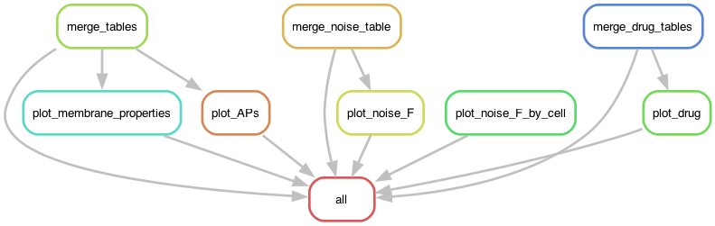

# parga_ephys_analysis

### Rulegraph


### Set-up Instructions
1. clone or fork this repo:
```
git clone https://github.com/alejandro-parga/parga_ephys_analysis
```
2. Install Conda Environment and activate
if needed instal conda [here](https://docs.conda.io/en/latest/miniconda.html#installing)
```
conda env create -n compCSV -f envs/compCSV.yaml
conda activate compCSV
```